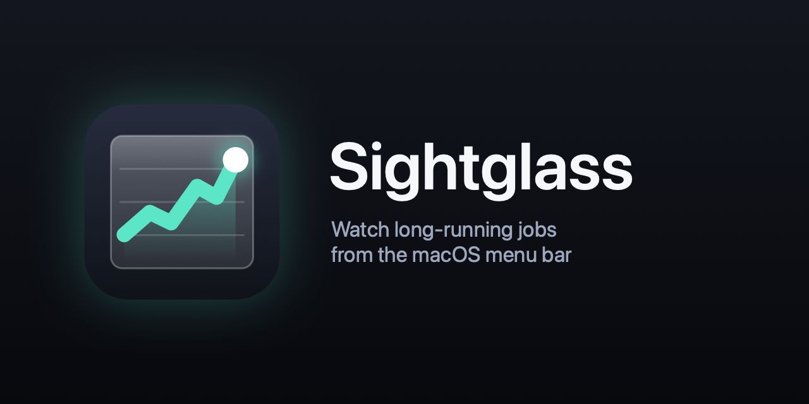

Point Sightglass at a JSON file your job keeps updating, tick the keys you care about, and watch them live in the menu bar as text, percentages, progress bars, rings, sparklines, rates with ETAs, or status badges.

Each watched file gets its own menu bar item. Click it for details.

## Requirements

- macOS 15 or later
- To build from source: Xcode 16 or later, or the matching Command Line Tools

## Install

With [Homebrew](https://brew.sh):

```sh
brew install --cask connickshields/tap/sightglass
```

Or build from source:

```sh
git clone https://github.com/connickshields/sightglass.git
cd sightglass
make install            # builds and copies Sightglass.app to /Applications
```

`make install PREFIX="$HOME/Applications"` installs somewhere else.

Builds on the [releases page](https://github.com/connickshields/sightglass/releases) are ad-hoc signed, not notarized, so macOS blocks a downloaded copy the first time you open it. Click **Open Anyway** in System Settings → Privacy & Security, or run `xattr -dr com.apple.quarantine /Applications/Sightglass.app`. The Homebrew cask removes the quarantine attribute during install.

## Use

1. Launch Sightglass. A gauge icon appears in the menu bar.
2. Choose **Add File…** and pick your job's status file.
3. In the Configure window, tick keys in the tree and choose how each one is shown. Changes save immediately.

The menu bar item dims and shows ⚠ when the file goes missing, stops parsing, or hasn't changed for the "Stale after" time (5 minutes by default).

### File formats

Sightglass detects the format automatically.

**A JSON document** that your job rewrites:

```json
{"status": "running", "progress": {"downloaded": 420, "total": 1000}}
```

Write it atomically if you can (write a temp file, then rename it over the old one). Otherwise Sightglass waits up to 5 seconds for a half-written file to become valid before showing an error.

**NDJSON**, one JSON object per line, appended as the job runs:

```
{"downloaded": 1, "total": 1000}
{"downloaded": 2, "total": 1000}
```

Sightglass reads only new lines, and earlier lines fill in sparklines. If the job starts the log over, history resets. Every line must be a JSON object or array, so keep other output (like stderr) out of the log.

### Displays

| Display | Shows |
|---|---|
| Text | The value, formatted as a number, bytes, or duration |
| Percent | `42%` from a value/total pair, a 0–1 fraction, or a 0–100 percentage |
| Progress bar / ring | The same, drawn as a bar or ring |
| Sparkline | Recent history of a number |
| Rate + ETA | `3.4 files/s · 12m`, from how fast a number grows toward a total |
| Status badge | A colored symbol for values like `running`, `done`, or `error` (editable rules) |

Numbers written as strings (`"42"`) work anywhere numbers do.

## Try it

```sh
make demo        # terminal 1: simulates a download job in build/demo/
make run-demo    # terminal 2: runs Sightglass watching it (uses a separate config)
```

## Development

```sh
make test        # unit tests (swift test)
make app         # build/Sightglass.app, ad-hoc signed
make zip VERSION=1.2.3 ARCHS="arm64 x86_64"   # universal build/Sightglass-1.2.3.zip
make icon        # regenerate the app icon and docs/images/ from Support/AppIcon.svg
swift run Sightglass
```

Settings live in `~/Library/Application Support/Sightglass/config.json`. Set `SIGHTGLASS_CONFIG=/path/to/config.json` to use a different file.

macOS asks for permission the first time Sightglass reads files in Desktop, Documents, or Downloads. Every build is ad-hoc signed, releases included, so macOS may ask again after a rebuild or upgrade.

To publish a release, push a version tag: `git tag v1.2.3 && git push origin v1.2.3`. The release workflow runs the tests, attaches a universal zip to a GitHub release, and updates the cask in [connickshields/homebrew-tap](https://github.com/connickshields/homebrew-tap). Published releases and their tags can't be changed, so fix a bad release by tagging a new version.

## License

MIT. See [LICENSE](LICENSE).
